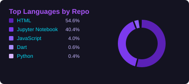
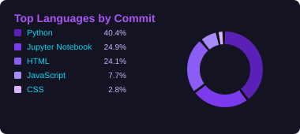

 

 
 

 

---

<!-- ===================== ABOUT ME ===================== -->

## 👩‍💻 About Me

I'm an Informatics Engineering student with an interest in Artificial Intelligence, Machine Learning, and Data Analytics.  
Currently exploring and building projects related to machine learning, recommendation systems, and data analysis.

---

<!-- ===================== GITHUB STATISTICS ===================== -->

## 📊 GitHub Statistics

 

### 💻 Top Languages

<table align="center">
  <tr>
    <td align="center" width="50%">
      
    </td>
    <td align="center" width="50%">
      
    </td>
  </tr>
</table>

 

### 🔥 GitHub Streak

 

---

<!-- ===================== LANGUAGES & TOOLS ===================== -->

<!-- LANGUAGES_TOOLS_START -->
## 🛠️ Languages & Tools

<h4>AI / Machine Learning</h4>

 
   

  
<h4>Data & Notebook</h4>

 
   

  
<h4>Development Tools</h4>

 
 

  

<!-- LANGUAGES_TOOLS_END -->

---

<!-- ===================== CONNECT ===================== -->

### 🤝 Let's Connect

  

**Thanks for visiting my profile! 💜**

  

